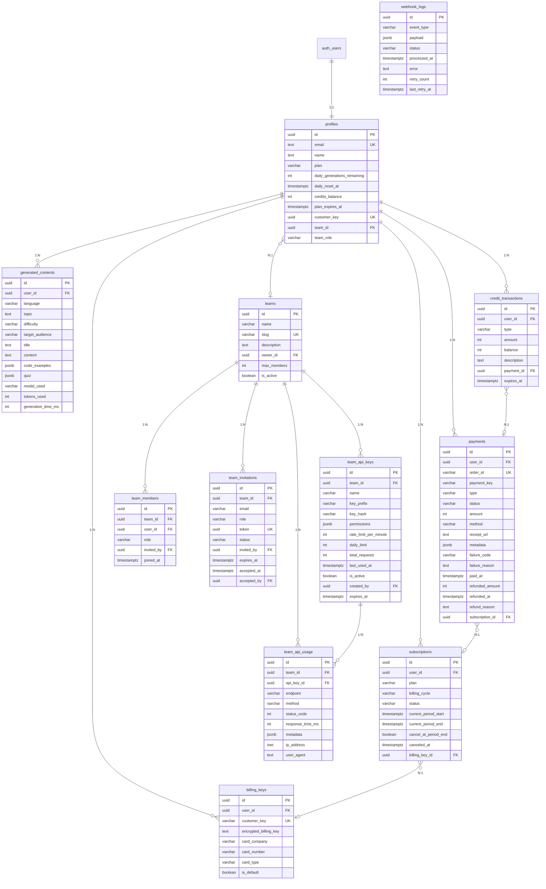

# CodeGen AI 데이터베이스 스키마

> **Version**: 1.1.0
> **Last Updated**: 2026-01-29
> **검증 상태**: ✅ SQL-TypeScript 타입 일치 확인
> **Database**: PostgreSQL (Supabase)

---

## 목차

1. [개요](#개요)
2. [ERD (Entity Relationship Diagram)](#erd)
3. [테이블 상세](#테이블-상세)
4. [뷰 (Views)](#뷰-views)
5. [RPC 함수](#rpc-함수)
6. [인덱스 전략](#인덱스-전략)
7. [RLS 정책](#rls-정책)
8. [마이그레이션 관리](#마이그레이션-관리)

---

## 개요

### 기술 스택

- **Database**: PostgreSQL 15+
- **Platform**: Supabase
- **Auth**: Supabase Auth (auth.users 연동)
- **RLS**: Row Level Security 전면 적용

### 스키마 구조

```
public/
├── Tables (12개)
│   ├── profiles              # 사용자 프로필 (auth.users 확장)
│   ├── generated_contents    # AI 생성 교육 콘텐츠
│   ├── subscriptions         # 정기 구독 정보
│   ├── payments              # 결제 이력 (단건 + 구독)
│   ├── billing_keys          # 빌링키 (AES-256 암호화)
│   ├── credit_transactions   # 크레딧 거래 내역
│   ├── webhook_logs          # 토스페이먼츠 웹훅 로그
│   ├── teams                 # 팀 정보
│   ├── team_members          # 팀 멤버 관계
│   ├── team_invitations      # 팀 초대
│   ├── team_api_keys         # 팀 API 키
│   └── team_api_usage        # API 사용량 로그
│
├── Views (2개)
│   ├── payment_stats         # 결제 통계 (환불 포함)
│   └── generation_stats      # 콘텐츠 생성 통계
│
└── Functions (15+개)
    ├── 원자적 트랜잭션 함수 (결제/구독)
    ├── 유틸리티 함수 (슬러그/주문ID 생성)
    ├── 크론잡 함수 (만료 처리)
    └── 웹훅 재처리 함수
```

---

## ERD

```
┌─────────────────────────────────────────────────────────────────────────────┐
│                         CodeGen AI Database Schema                          │
└─────────────────────────────────────────────────────────────────────────────┘

    ┌─────────────┐
    │ auth.users  │ (Supabase Auth)
    └──────┬──────┘
           │ 1:1
           ▼
    ┌─────────────┐          ┌──────────────────┐
    │  profiles   │ 1 ─── N  │ generated_contents│
    └──────┬──────┘          └──────────────────┘
           │
           ├──── 1:N ────┐
           │             │
           ▼             ▼
    ┌─────────────┐ ┌─────────────┐
    │subscriptions│ │  payments   │
    └──────┬──────┘ └──────┬──────┘
           │               │
           │    ┌──────────┘
           │    │
           ▼    ▼
    ┌─────────────┐     ┌────────────────────┐
    │billing_keys │     │credit_transactions │
    └─────────────┘     └────────────────────┘

    ┌─────────────┐
    │   teams     │
    └──────┬──────┘
           │
           ├─── 1:N ───┬─── 1:N ───┬─── 1:N ───┐
           │           │           │           │
           ▼           ▼           ▼           ▼
    ┌────────────┐ ┌───────────┐ ┌───────────┐ ┌────────────┐
    │team_members│ │team_invite│ │team_api_  │ │team_api_   │
    │            │ │ations    │ │keys       │ │usage       │
    └────────────┘ └───────────┘ └───────────┘ └────────────┘
```

### Mermaid ERD



---

## 테이블 상세

### profiles (사용자 프로필)

| 컬럼 | 타입 | Nullable | 기본값 | 설명 |
|------|------|----------|--------|------|
| `id` | UUID | NO | - | PK, auth.users.id 참조 |
| `email` | TEXT | NO | - | 이메일 (Unique) |
| `name` | TEXT | YES | NULL | 이름 |
| `plan` | VARCHAR(20) | NO | 'starter' | 플랜 (starter/pro/team/enterprise) |
| `daily_generations_remaining` | INTEGER | NO | 10 | 오늘 남은 생성 횟수 |
| `daily_reset_at` | TIMESTAMPTZ | YES | NULL | 일일 리셋 시간 |
| `credits_balance` | INTEGER | NO | 0 | 크레딧 잔액 |
| `plan_expires_at` | TIMESTAMPTZ | YES | NULL | 플랜 만료일 |
| `customer_key` | UUID | NO | gen_random_uuid() | 토스페이먼츠 고객 키 |
| `team_id` | UUID | YES | NULL | 소속 팀 ID |
| `team_role` | VARCHAR(10) | YES | NULL | 팀 역할 (owner/admin/member) |
| `created_at` | TIMESTAMPTZ | NO | NOW() | 생성일 |
| `updated_at` | TIMESTAMPTZ | NO | NOW() | 수정일 |

**인덱스**:
- `idx_profiles_customer_key` (UNIQUE)
- `fk_profiles_team_id`

---

### generated_contents (생성된 콘텐츠)

| 컬럼 | 타입 | Nullable | 기본값 | 설명 |
|------|------|----------|--------|------|
| `id` | UUID | NO | gen_random_uuid() | PK |
| `user_id` | UUID | NO | - | FK → profiles.id |
| `language` | VARCHAR(20) | NO | - | 프로그래밍 언어 |
| `topic` | TEXT | NO | - | 주제 |
| `difficulty` | VARCHAR(20) | NO | - | 난이도 |
| `target_audience` | VARCHAR(30) | NO | - | 대상 학습자 |
| `title` | TEXT | YES | NULL | 제목 |
| `content` | TEXT | NO | - | 생성된 콘텐츠 |
| `code_examples` | JSONB | YES | NULL | 코드 예제들 |
| `quiz` | JSONB | YES | NULL | 퀴즈 |
| `model_used` | VARCHAR(50) | YES | NULL | 사용된 AI 모델 |
| `tokens_used` | INTEGER | YES | NULL | 사용된 토큰 수 |
| `generation_time_ms` | INTEGER | YES | NULL | 생성 소요 시간 (ms) |
| `created_at` | TIMESTAMPTZ | NO | NOW() | 생성일 |
| `updated_at` | TIMESTAMPTZ | NO | NOW() | 수정일 |

**인덱스**:
- `idx_generated_contents_user_id`
- `idx_generated_contents_created_at`
- `idx_generated_contents_language`

---

### subscriptions (구독)

| 컬럼 | 타입 | Nullable | 기본값 | 설명 |
|------|------|----------|--------|------|
| `id` | UUID | NO | gen_random_uuid() | PK |
| `user_id` | UUID | NO | - | FK → profiles.id |
| `plan` | VARCHAR(20) | NO | - | 플랜 (pro/team/enterprise) |
| `billing_cycle` | VARCHAR(10) | NO | - | 결제 주기 (monthly/yearly) |
| `status` | VARCHAR(20) | NO | 'active' | 상태 (active/canceled/past_due/trialing/paused) |
| `current_period_start` | TIMESTAMPTZ | NO | - | 현재 기간 시작 |
| `current_period_end` | TIMESTAMPTZ | NO | - | 현재 기간 종료 |
| `cancel_at_period_end` | BOOLEAN | NO | FALSE | 기간 종료 시 취소 여부 |
| `canceled_at` | TIMESTAMPTZ | YES | NULL | 취소 요청일 |
| `billing_key_id` | UUID | YES | NULL | FK → billing_keys.id |
| `created_at` | TIMESTAMPTZ | NO | NOW() | 생성일 |
| `updated_at` | TIMESTAMPTZ | NO | NOW() | 수정일 |

**인덱스**:
- `idx_subscriptions_user_id`
- `idx_subscriptions_status`
- `idx_subscriptions_period_end`

---

### payments (결제)

| 컬럼 | 타입 | Nullable | 기본값 | 설명 |
|------|------|----------|--------|------|
| `id` | UUID | NO | gen_random_uuid() | PK |
| `user_id` | UUID | NO | - | FK → profiles.id |
| `order_id` | VARCHAR(100) | NO | - | 주문 ID (Unique) |
| `payment_key` | VARCHAR(200) | YES | NULL | 토스 결제 키 |
| `type` | VARCHAR(20) | NO | - | 유형 (subscription/credit_purchase) |
| `status` | VARCHAR(20) | NO | 'pending' | 상태 |
| `amount` | INTEGER | NO | - | 금액 |
| `method` | VARCHAR(50) | YES | NULL | 결제 수단 |
| `receipt_url` | TEXT | YES | NULL | 영수증 URL |
| `metadata` | JSONB | NO | '{}' | 메타데이터 |
| `failure_code` | VARCHAR(50) | YES | NULL | 실패 코드 |
| `failure_reason` | TEXT | YES | NULL | 실패 사유 |
| `paid_at` | TIMESTAMPTZ | YES | NULL | 결제 완료 시간 |
| `refunded_amount` | INTEGER | YES | NULL | 환불 금액 |
| `refunded_at` | TIMESTAMPTZ | YES | NULL | 환불 시간 |
| `refund_reason` | TEXT | YES | NULL | 환불 사유 |
| `subscription_id` | UUID | YES | NULL | 관련 구독 ID |
| `created_at` | TIMESTAMPTZ | NO | NOW() | 생성일 |
| `updated_at` | TIMESTAMPTZ | NO | NOW() | 수정일 |

**인덱스**:
- `idx_payments_user_id`
- `idx_payments_order_id` (UNIQUE)
- `idx_payments_payment_key`
- `idx_payments_status`
- `idx_payments_created_at`

---

### billing_keys (빌링키)

| 컬럼 | 타입 | Nullable | 기본값 | 설명 |
|------|------|----------|--------|------|
| `id` | UUID | NO | gen_random_uuid() | PK |
| `user_id` | UUID | NO | - | FK → profiles.id |
| `customer_key` | VARCHAR(100) | NO | - | 토스 고객 키 |
| `encrypted_billing_key` | TEXT | NO | - | 암호화된 빌링키 (AES-256) |
| `card_company` | VARCHAR(50) | NO | - | 카드사 |
| `card_number` | VARCHAR(20) | NO | - | 마스킹된 카드번호 |
| `card_type` | VARCHAR(20) | YES | NULL | 카드 유형 |
| `is_default` | BOOLEAN | NO | FALSE | 기본 결제 수단 여부 |
| `created_at` | TIMESTAMPTZ | NO | NOW() | 생성일 |
| `updated_at` | TIMESTAMPTZ | NO | NOW() | 수정일 |

**인덱스**:
- `idx_billing_keys_user_id`
- `idx_billing_keys_customer_key` (UNIQUE)
- `idx_billing_keys_default` (Partial: is_default = TRUE, Unique per user)

---

### credit_transactions (크레딧 거래)

| 컬럼 | 타입 | Nullable | 기본값 | 설명 |
|------|------|----------|--------|------|
| `id` | UUID | NO | gen_random_uuid() | PK |
| `user_id` | UUID | NO | - | FK → profiles.id |
| `type` | VARCHAR(30) | NO | - | 유형 (purchase/subscription_grant/usage/refund/expiry/admin_adjustment) |
| `amount` | INTEGER | NO | - | 금액 (양수: 충전, 음수: 사용) |
| `balance` | INTEGER | NO | - | 거래 후 잔액 |
| `description` | TEXT | YES | NULL | 설명 |
| `payment_id` | UUID | YES | NULL | FK → payments.id |
| `expires_at` | TIMESTAMPTZ | YES | NULL | 만료일 |
| `created_at` | TIMESTAMPTZ | NO | NOW() | 생성일 |

**인덱스**:
- `idx_credit_transactions_user_id`
- `idx_credit_transactions_created_at`
- `idx_credit_transactions_expires_at`

---

### webhook_logs (웹훅 로그)

| 컬럼 | 타입 | Nullable | 기본값 | 설명 |
|------|------|----------|--------|------|
| `id` | UUID | NO | gen_random_uuid() | PK |
| `event_type` | VARCHAR(50) | NO | - | 이벤트 유형 |
| `payload` | JSONB | NO | - | 페이로드 |
| `status` | VARCHAR(20) | NO | 'pending' | 상태 (pending/processed/failed/retrying) |
| `processed_at` | TIMESTAMPTZ | YES | NULL | 처리 완료 시간 |
| `error` | TEXT | YES | NULL | 에러 메시지 |
| `retry_count` | INTEGER | NO | 0 | 재시도 횟수 |
| `last_retry_at` | TIMESTAMPTZ | YES | NULL | 마지막 재시도 시간 |
| `created_at` | TIMESTAMPTZ | NO | NOW() | 생성일 |

**인덱스**:
- `idx_webhook_logs_event_type`
- `idx_webhook_logs_status`
- `idx_webhook_logs_status_created`
- `idx_webhook_logs_created_at`

---

### teams (팀)

| 컬럼 | 타입 | Nullable | 기본값 | 설명 |
|------|------|----------|--------|------|
| `id` | UUID | NO | gen_random_uuid() | PK |
| `name` | VARCHAR(100) | NO | - | 팀 이름 |
| `slug` | VARCHAR(100) | NO | - | URL 슬러그 (Unique) |
| `description` | TEXT | YES | NULL | 설명 |
| `owner_id` | UUID | NO | - | FK → profiles.id |
| `max_members` | INTEGER | NO | 5 | 최대 멤버 수 |
| `is_active` | BOOLEAN | NO | TRUE | 활성 상태 |
| `created_at` | TIMESTAMPTZ | NO | NOW() | 생성일 |
| `updated_at` | TIMESTAMPTZ | NO | NOW() | 수정일 |

---

### team_members, team_invitations, team_api_keys, team_api_usage

팀 관련 부가 테이블들 - 자세한 내용은 `database.types.ts` 참조.

---

## 뷰 (Views)

### payment_stats

사용자별 결제 통계 뷰.

```sql
SELECT
    user_id,
    COUNT(*) as total_payments,
    SUM(amount) as total_amount,
    COUNT(*) FILTER (WHERE status IN ('refunded', 'partial_refunded')) as total_refunds,
    MAX(paid_at) as last_payment_at
FROM payments
WHERE status = 'completed'
GROUP BY user_id;
```

### generation_stats

사용자별 콘텐츠 생성 통계 뷰.

```sql
SELECT
    user_id,
    COUNT(*) as total_generations,
    COUNT(*) FILTER (WHERE created_at >= CURRENT_DATE) as today_generations,
    COUNT(*) FILTER (WHERE created_at >= CURRENT_DATE - INTERVAL '7 days') as week_generations,
    array_agg(DISTINCT language) as used_languages,
    MAX(created_at) as last_generation_at
FROM generated_contents
GROUP BY user_id;
```

---

## RPC 함수

### 트랜잭션 원자성 함수

| 함수명 | 용도 | 사용처 |
|--------|------|--------|
| `confirm_credit_payment_atomic` | 크레딧 결제 원자적 처리 | `payment.ts` ✅ |
| `confirm_subscription_atomic` | 구독 확정 원자적 처리 | `subscription.ts` ❌ (미사용) |
| `renew_subscription_atomic` | 구독 갱신 원자적 처리 | `subscription.ts` ❌ (미사용) |
| `restore_generation_credit` | 생성 실패 시 크레딧 복구 | - |

### 유틸리티 함수

| 함수명 | 용도 |
|--------|------|
| `generate_order_id` | 주문 ID 생성 (PREFIX_TIMESTAMP_RANDOM) |
| `generate_team_slug` | 팀 URL 슬러그 생성 |
| `get_team_member_count` | 팀 멤버 수 조회 |
| `use_generation_credit` | 콘텐츠 생성 시 크레딧/횟수 차감 |
| `reset_daily_generations_safe` | 일일 생성 횟수 리셋 (Advisory lock) |
| `expire_credits_safe` | 만료 크레딧 처리 (Advisory lock) |
| `check_expired_subscriptions` | 만료 구독 확인 |
| `get_subscriptions_due_for_renewal` | 갱신 대상 구독 조회 |
| `get_failed_webhooks` | 실패 웹훅 조회 |
| `mark_webhook_for_retry` | 웹훅 재시도 표시 |

### 트리거

| 트리거명 | 테이블 | 동작 |
|----------|--------|------|
| `update_*_updated_at` | 모든 테이블 | UPDATE 시 updated_at 자동 갱신 |
| `after_credit_transaction` | credit_transactions | INSERT 시 profiles.credits_balance 동기화 |
| `after_subscription_change` | subscriptions | INSERT/UPDATE 시 profiles.plan 동기화 |

---

## 인덱스 전략

### 복합 인덱스

```sql
-- 결제 조회 최적화 (상태 + 생성일)
CREATE INDEX idx_payments_status_created ON payments(status, created_at DESC);

-- 웹훅 재처리 조회 최적화
CREATE INDEX idx_webhook_logs_status_created ON webhook_logs(status, created_at DESC);

-- 구독 갱신 대상 조회 최적화
CREATE INDEX idx_subscriptions_active_period ON subscriptions(status, current_period_end)
    WHERE status = 'active';
```

### Partial 인덱스

```sql
-- 기본 결제 수단 (사용자당 하나만)
CREATE UNIQUE INDEX idx_billing_keys_default ON billing_keys(user_id)
    WHERE is_default = TRUE;

-- 활성 구독만
CREATE INDEX idx_subscriptions_active ON subscriptions(user_id)
    WHERE status = 'active';
```

---

## RLS 정책

### 기본 패턴

```sql
-- 사용자는 자신의 데이터만 조회 가능
CREATE POLICY "Users can view own data"
    ON table_name FOR SELECT
    USING (auth.uid() = user_id);

-- Service Role은 모든 작업 가능
CREATE POLICY "Service role can manage all"
    ON table_name FOR ALL
    USING (auth.jwt()->>'role' = 'service_role');
```

### 테이블별 RLS

| 테이블 | SELECT | INSERT | UPDATE | DELETE |
|--------|--------|--------|--------|--------|
| profiles | own | - | own | - |
| generated_contents | own | own | own | own |
| subscriptions | own | service | service | - |
| payments | own | service | service | - |
| billing_keys | own (metadata) | service | service | - |
| credit_transactions | own | service | - | - |
| webhook_logs | - | service | service | - |
| teams | member | owner | admin+ | owner |

---

## 마이그레이션 관리

### 마이그레이션 파일

```
supabase/migrations/
├── 001_profiles.sql              # 프로필 테이블
├── 002_generated_contents.sql    # 콘텐츠 테이블
├── 003_payment_tables.sql        # 결제 관련 테이블
├── 004_team_tables.sql           # 팀 관련 테이블
├── 005_schema_improvements.sql   # 스키마 개선
├── 006_transaction_functions.sql # RPC 함수
└── 007_payment_refund_columns.sql # 환불 관련 컬럼 추가
```

### 마이그레이션 명령어

```bash
# 타입 생성
npm run db:generate

# 마이그레이션 적용
npm run db:migrate

# DB 리셋 (개발용)
npm run db:reset
```

### 새 마이그레이션 추가

```bash
# 새 마이그레이션 파일 생성
supabase migration new feature_name

# 파일 위치: supabase/migrations/YYYYMMDDHHMMSS_feature_name.sql
```

---

## 개선 필요 사항

### Critical

| 항목 | 현재 상태 | 개선 방안 | 담당 |
|------|----------|----------|------|
| subscription.ts RPC 미사용 | 개별 쿼리 | `confirm_subscription_atomic` 사용 | 터미널 1 |
| subscription 갱신 RPC 미사용 | 개별 쿼리 | `renew_subscription_atomic` 사용 | 터미널 1 |

### Recommendation

| 항목 | 설명 |
|------|------|
| 결제 실패 재시도 테이블 | 자동 재시도 로직을 위한 별도 테이블 고려 |
| 크레딧 만료 알림 | 만료 30일 전 알림 배치 작업 추가 |
| 구독 갱신 스케줄러 | Supabase Edge Functions + pg_cron 연동 |

---

*마지막 업데이트: 2026-01-29*
